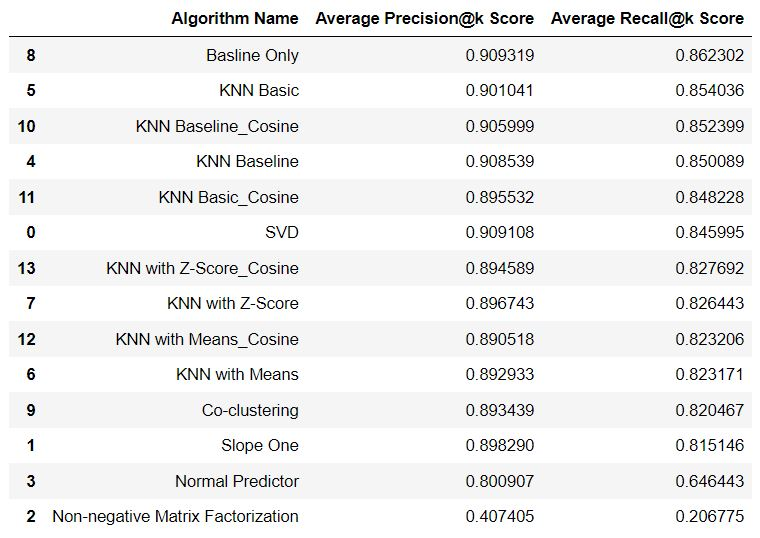
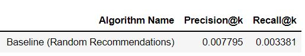
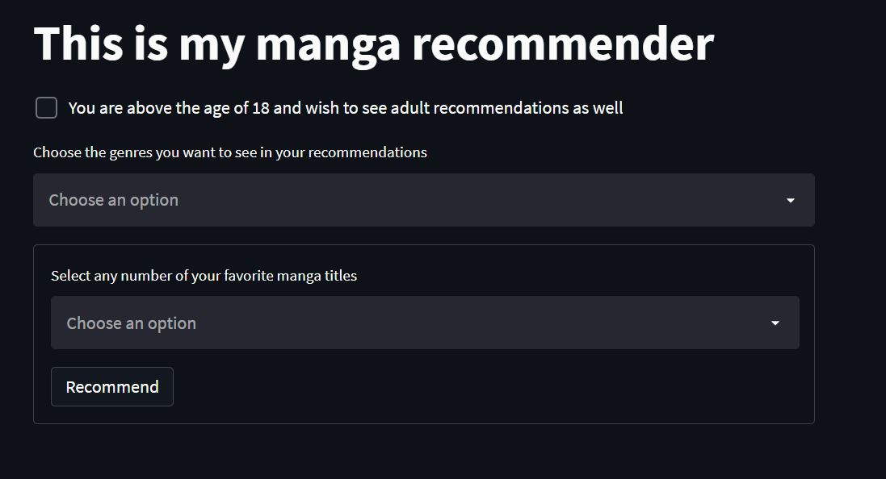

# Background
The Japanese Manga Market saw an increase in sales by 10.3% in 2021 to reach 675.9 Billion Yen. This pushed manga sales to 40.4% of all domestic publishing sales in Japan, crossing the 40% mark for the first time in history ([AnimeHunch][1]).

Over in America, it was reported that manga sales made Up 76.71% of all Adult Fiction Graphic Novel Sales in 2021 ([AnimeNewsNetwork][2]).

With more than 100,000 titles to choose from, it can be a very daunting task to enter the world of manga. Even for the veterans, there are always more titles to be discovered.

[1]: https://animehunch.com/japanese-manga-market-increases-by-10-3-in-2021-to-675-9-billion-yen/ "AnimeHunch"

[2]: https://www.animenewsnetwork.com/news/2022-03-01/npd-bookscan-via-the-beat-manga-made-up-76.71-percent-of-adult-fiction-graphic-novel-sales-in-2021/.182296 "AnimeNewsNetwork"

# Objective
[MyAnimeList][3] (MAL) is the world's largest Anime and Manga community.

It has hundreds of thousands of users in its community that actively rate, share and talk about manga titles.

The objective of this project is to build a user-based manga recommender system by utilizing the rating lists of users on MAL.

The completed app can be assessed [here][10].

[3]: https://myanimelist.net/about.php "MyAnimeList"
# Data Dictionary
[10]: https://share.streamlit.io/bryansoh/mangarecommender "Streamlit App"

| Feature |	 Description |
| --- | --- |
|title| manga title|
|mal_id|ID number of title on MAL|
|url|URL to title on MAL|
|image|URL to cover image of title on MAL|
|synopsis|synopsis of title|
|combined title|combination of title and its synonyms|
|Drama, Action etc.|each genre has its own column, with a value of either 0 or 1|

# Methodology

1. Scrape a list of usernames using [Jikan API][4]
- Rather than scraping by user ID number, scrape members from the largest MAL user community called "[Recommendation Club][5]"
- Assume users in communities are more active in rating titles
- Since this club was created in 2010 and still active today in 2022, assume it has a good spread of old and new users
2. Use the list of usernames to scrape their respective lists of manga ratings
- Note that Jikan API is [deprecating this function][6] in May 2022
3. Conduct EDA on data
- MAL ratings are on a scale of 0 to 10
- Almost half the ratings were 0 scores
- Removed all 0 scores from data; almost 2,000 users only had 0 scores in their rating list
4. Data Modeling using [scikit-surprise library][7]
- Details on models used can be found in the [library documentation][8]
5. Scoring models 
- Parameters selected for this project are k = 10, and a threshold of >= 7/10 score to be considered a relevant recommendation
- The scores are the calculated average after 5 folds of cross validation
- Baseline model used was random recommendations. The model randomly recommends 10 titles to each user and the scores are calculated from these recommendations
6. Select the best performing model
- Baseline Only was the best performing model with a precision@10 score of 0.909 and recall@10 score of 0.862
7. Build and deploy the recommender system using [Streamlit][9]

[4]: https://docs.api.jikan.moe/ "Jikan API"
[5]: https://myanimelist.net/clubs.php?cid=20081 "Recommendation Club"
[6]: https://docs.google.com/document/d/1-6H-agSnqa8Mfmw802UYfGQrceIEnAaEh4uCXAPiX5A/edit "Deprecating Mangalists"
[7]: https://github.com/NicolasHug/Surprise "Scikit-Surprise"
[8]: https://surprise.readthedocs.io/en/stable/prediction_algorithms_package.html "Model Documentation"
[9]: https://streamlit.io/ "Streamlit"

# Key Findings
## Model Selection

- The scores above are calculated with a relevant score threshold of >= 7/10, at k =10
- The scores are the calculated average after 5 folds of cross validation
- The Baseline Only model performed the best and its recall and precision scores are almost a whole 1% higher than the 2nd best model

- The machine learning models all vastly outperformed the baseline model that gives random recommendations

# Streamlit

- [Link to Streamlit App][10]
- Checkbox to toggle on/off the showing of recommendations with adult genres
- User inputs genre preference for the recommendations generated. Only recommendations containing at least 1 of the selected genres will be shown.
- User inputs favorite manga titles. These titles will be automatically given the maximum rating of 10.

# Limitations of Recommender System
- The recommender system can only recommend manga titles that are present in its data (~2,900 titles).
- Data was scrapped in March 2022. Hence, newer titles will not be included.
- Data is scrapped from the largest user community on MAL called "Recommendation Club", ratings will not be reflective of all manga readers

# Citations
1. [Japanese Manga Market Increases By 10.3% In 2021 To 675.9 Billion Yen][1]
2. [NPD Bookscan via The Beat: Manga Made Up 76.71% of Adult Fiction Graphic Novel Sales in 2021][2]
